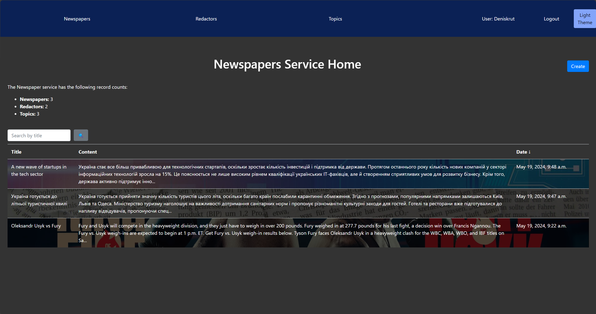
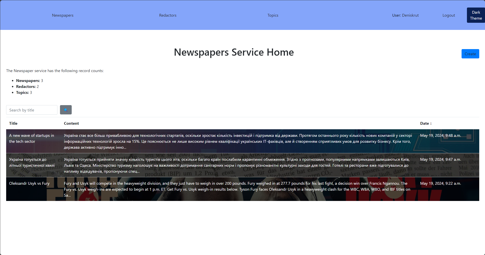

# Newspaper Agency Project

As the head of a newspaper agency, you are responsible for managing a team of editors. However, there is currently no reliable system in place to track which editors are responsible for publishing each newspaper. To solve this problem, I have decided to create a system that will allow you to track the editors associated with each newspaper; create, update and manage newspapers and topics.

## Features:
- Develop a system to keep track of editors and their assignments.
- Guarantee that you will always know which editors were responsible for publishing each newspaper.
- Create dark and light themes, add images for each news story, easily register and add topics, and create, update, and delete newspapers with other users.

## Install Project:
- Run the `python manage.py runserver` command to start the server.
- Make sure that `DEBUG = False` is set before starting the project.

## Commands to build and run:
- Build: `./build.sh`.
- Run: `gunicorn Newspaper_Agency_mate.asgi:application -k uvicorn.workers.UvicornWorker`.
- To run locally: `python manage.py runserver`.

## Primary user credentials:
- Username: `semermaks`
- Password: `1qazcde3`.

## Project References:
- [Newspaper Agency Site](https://newspaper-agency-mate-hlbp.onrender.com/) **Check this out!**
- [GitHub Repository](https://github.com/semermaks/Newspaper-Agency-mate/tree/develop)
- [Source Code on GitHub](https://github.com/semermaks/Newspaper-Agency-mate.git)

## Images:

